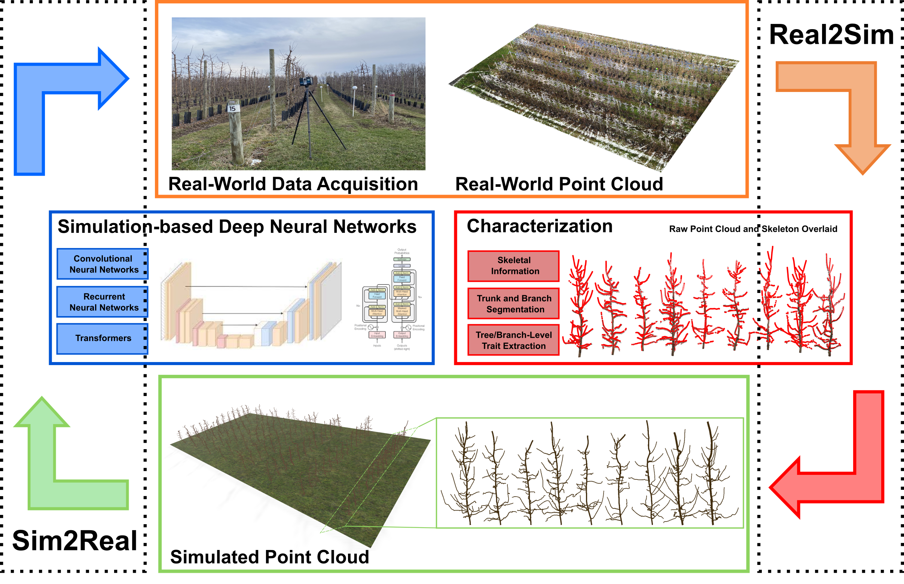

# $\text{(Real2Sim)}^{-1}$: 3D Branch Point Cloud Completion for Robotic Pruning

### This work is now accepted at IROS 2024.

#### [paper](https://arxiv.org/abs/2404.05953)

## Abstract

In this work, we addressed the issue of point
cloud quality through a simulation-based deep neural network,
leveraging a Real-to-Simulation (Real2Sim) data generation
pipeline that not only eliminates the need of manual parameterization but also guarantees the realism of simulated data. The
simulation-based neural network was applied to jointly perform
point cloud completion and skeletonization on real-world partial
branches, without additional real-world training.



## Usage

The **data** folder contains the simulated branch datasets (i.e., ***NB*** and ***FB*** branches), while **Sim2Real** folder for simulation-based model training and inference. 


## License
MIT License

## Citation
If you find our work useful in your research, please consider citing: 
```
@article{qiu20243d,
  title={3D Branch Point Cloud Completion for Robotic Pruning in Apple Orchards},
  author={Qiu, Tian and Zoubi, Alan and Cheng, Lailiang and Jiang, Yu},
  journal={arXiv preprint arXiv:2404.05953},
  year={2024}
}
```